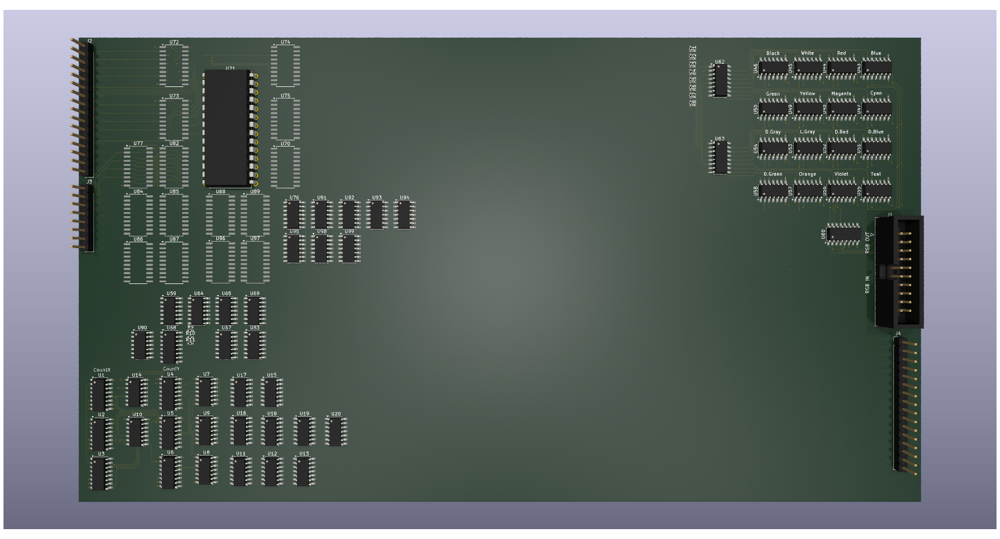

# DIY Video #

The DIY Video project is an attempt to define a reusable video "chip" with
modular components. The concept is to limit the design to regular 74LS
ICs.

The goal is a design that can be plugged into most (if not all) 8-bit
computers.

The minimal design permits a system that can switch between a simple
text mode and bitmap mode with a usable screen resolution of 320x200 pixels.
Output is unterminated RGB that can be transformed into an appropriate
format as required

## Design Concepts ##

Each major component of the video system is deliberately isolated so
that a change in one area should not require rework elsewhere. This rule
is broken in some places but is respected as much as possible

The core of the system is a pair of counters that track the X and Y 
position of the "beam". These counters are then used to define the
frame timing (sync and blank) and the viewport position on the screen.

The frame timing also controls what video source makes it to the output
as the sync and blank phases of the signal fall under timing control.

The bitmap renderer uses the pixel counters to generate a palette index
based on either a 1, 2 or 4 bit length value. The index is turned into
RGB using a separate pair of modules that generate 16 distinct RGB values
and a decoder that switches the RGB output between the 16 different
palette options

Independently to all this is the memory controller, actually a repeated
module that provisions different, parallel rendering mechanisms. From
the perspective of the video system each has its own address register
and can be accessed independently of the others - so the bitmap, tile
and sprite data can be operated separately without impacting the timing
of the other.

Externally the different blocks of memory needed to be mapped into the
hosts address space. To facilitate this the different memory blocks
are first selected by a device select signal and are then (optionally)
paged to ease the host burden. 

This approach makes the internal address very wide - each memory block is
a maximum of 32K and with distinct address buses and data buses the burden
for the video system is high but the length and distribution of those
buses can be minimised leaving just the palette values as the the 
interconnect rather than wide data and address buses

The current design respects five different addressable sub-devices
Bitmap memory  
Tile memory  
Sprite memory  
Font generator  
Control registers  

Only the bitmap and control registers are currently implemented.

The font generator in initial design iterations will be a simple eprom that
does not require external addressing

## Roadmap ##

### Stage 1 ###

The initial design stage is to define the hardware and interfaces, the broad
timing requirements and what modules are dependent. The goal is to achieve
a design that can be tested in self-contained modules, that together can
implement a basic bitmap based video generator.

### Stage 2 ###

The initial design will be verified and refined to prove that the modules work.
No attempt to integrate the modules will be attempted at this stage. Signal
and power requirements will be added to the design

### Stage 3 ###

Modules will be implemented as independent PCBs to be re-verified. A backplane
to integrate the modules will be needed with scope to extend the design to 
include other sub-systems

### Stage 4 ###

This is the first opportunity to integrate the entire set of modules defined.
To provide a usable display that can be verified the system will also need
to be integrated with a host computer to drive the video memory content

## License ##

This project is licensed under CC BY-SA 4.0
<https://creativecommons.org/licenses/by-sa/4.0/>

